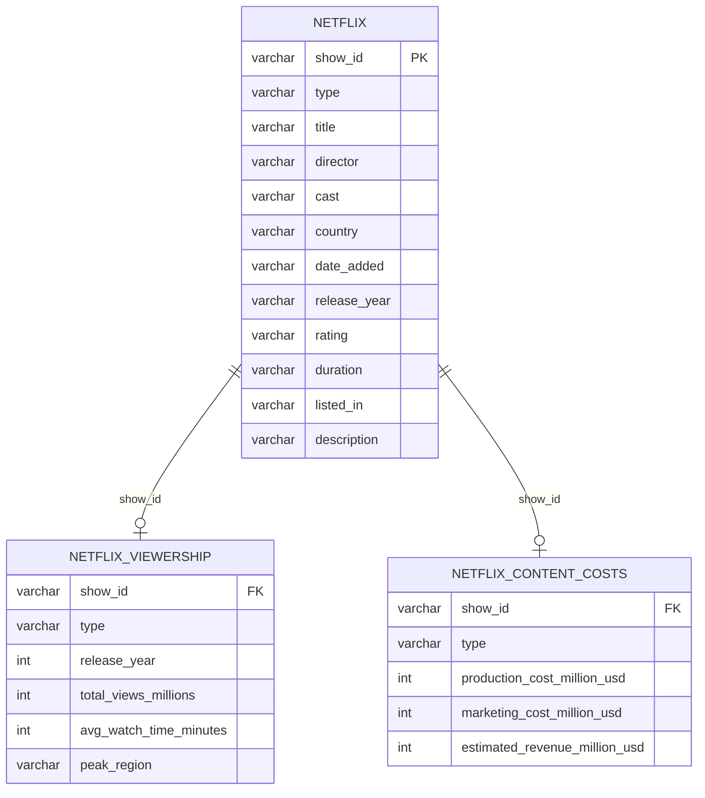

# Netflix Content Analysis using SQL

An end-to-end SQL project that explores Netflix's content library and answers business questions about **content mix, genres, countries, viewership, engagement and profitability**, using MySQL.

  

---

## Table of Contents
- [Project Overview](#project-overview)
- [Business Questions](#business-questions)
- [Dataset](#dataset)
- [Database Schema](#database-schema)
- [Project Structure](#project-structure)
- [How to Run](#how-to-run)
- [Analysis Performed](#analysis-performed)
- [SQL Concepts Used](#sql-concepts-used)
- [Key Insights](#key-insights)
- [Data Quality Notes](#data-quality-notes)
- [Author](#author)

---

## Project Overview

This project analyses Netflix's catalogue of Movies and TV Shows across three related tables:

1. **Content catalogue**: titles, cast, directors, countries, genres, ratings
2. **Viewership**: total views, average watch time, peak region
3. **Content costs**: production cost, marketing cost, estimated revenue

The work is split into 17 analytical queries and 6 business-insight queries, moving from basic aggregations to multi-table joins, window functions and recursive CTEs.

## Business Questions

- What is the split between Movies and TV Shows, and how has it changed over time?
- Which countries, genres and directors dominate the catalogue?
- Which content type and which genres generate the most views?
- Which titles are the most profitable, and does a bigger budget guarantee higher profit?
- Which countries show the highest engagement (average watch time)?
- Do higher-rated (more mature) titles attract more views?

## Dataset

| File | Description |
|------|-------------|
| `netflix.csv` | Netflix Movies and TV Shows catalogue (show_id, type, title, director, cast, country, date_added, release_year, rating, duration, listed_in, description) |
| `netflix_viewership.csv` | Total views (millions), average watch time (minutes) and peak region per title |
| `netflix_content_costs.csv` | Production cost, marketing cost and estimated revenue (USD millions) per title |

See [`data/README.md`](data/README.md) for the full column dictionary.

## Database Schema



## Project Structure

```
netflix-sql-analysis/
├── README.md
├── LICENSE
├── .gitignore
├── data/
│   ├── README.md                    # column dictionary
│   ├── netflix.csv
│   ├── netflix_viewership.csv
│   └── netflix_content_costs.csv
├── sql/
│   ├── 01_database_setup.sql        # create DB, tables, load data, clean, add keys
│   ├── 02_data_analysis_queries.sql # Q1-Q17
│   └── 03_business_insights.sql     # B1-B6
└── images/                          # screenshots of query outputs
```

## How to Run

**Requirements:** MySQL 8.0 or higher (window functions and recursive CTEs are used) and MySQL Workbench or any SQL client.

1. Clone the repository
   ```bash
   git clone https://github.com/YOUR-USERNAME/netflix-sql-analysis.git
   ```
2. Open `sql/01_database_setup.sql` and **update the three file paths** in the `LOAD DATA LOCAL INFILE` statements so they point to the CSV files in the `data/` folder.
3. Run the scripts in order:
   - `01_database_setup.sql`
   - `02_data_analysis_queries.sql`
   - `03_business_insights.sql`

> If `LOAD DATA LOCAL INFILE` is blocked, enable `local_infile` on both the server and the client connection (in MySQL Workbench: *Edit Connection > Advanced > Others > `OPT_LOCAL_INFILE=1`*), or use Workbench's **Table Data Import Wizard**.

## Analysis Performed

### A. Core queries (`02_data_analysis_queries.sql`)

| # | Question |
|---|----------|
| 1 | Count of Movies vs TV Shows |
| 2 | Most common rating for Movies and TV Shows |
| 3 | Movies released in a specific year |
| 4 | Top 5 countries by content volume |
| 5 | Longest movie |
| 6 | Content added in the last 5 years |
| 7 | Titles by director Rajiv Chilaka |
| 8 | TV shows with more than 5 seasons |
| 9 | Content count per genre |
| 10 | Top 5 years by share of India's content added |
| 11 | Documentary movies |
| 12 | Content with no director listed |
| 13 | Movies by Salman Khan in the last 10 years |
| 14 | Top 10 actors in Indian movies |
| 15 | Good / Bad content labelling by description keywords |

### B. Advanced queries
| # | Question |
|---|----------|
| 16 | Top 3 most profitable titles per content type released after 2018 (with rank) |
| 17 | Country with the highest views among above-average watch-time titles, and its top title |

### C. Business insights (`03_business_insights.sql`)
| # | Question |
|---|----------|
| B1 | Which content type is more profitable? |
| B2 | Which genres generate the highest views? |
| B3 | Is a higher budget always more profitable? |
| B4 | Which countries have the highest engagement? |
| B5 | Top 5 most successful titles |
| B6 | Do higher-rated titles get more views? |

## SQL Concepts Used

- Aggregations: `COUNT`, `SUM`, `AVG`, `ROUND`, `GROUP BY`
- Joins: `INNER JOIN` across 2 and 3 tables
- CTEs and **recursive CTEs** (splitting comma-separated genres and cast lists into rows)
- **Window functions**: `ROW_NUMBER() OVER (PARTITION BY ...)`
- Conditional logic with `CASE WHEN`
- Date handling: `STR_TO_DATE`, `DATE_SUB`, `YEAR`, `CURDATE`
- String functions: `TRIM`, `SUBSTRING_INDEX`, `SUBSTRING`, `LOCATE`, `LOWER`, `LIKE`
- Subqueries, `NULLIF`, `CAST`
- Constraints: primary and foreign keys
- Data cleaning (blank values converted to `NULL`)

## Key Insights

> _Add your findings here after running the queries. Two to four lines per question, with numbers. Example format:_
>
> - **Movies vs TV Shows:** _Movies make up X% of the catalogue and TV Shows Y%._
> - **Profitability:** _[Movies / TV Shows] earn higher average profit (X million USD vs Y million USD)._
> - **Budget vs profit:** _[Describe whether high-budget titles earned more profit than low-budget ones.]_
> - **Top genres by views:** _[Genre 1, Genre 2, Genre 3]._
> - **Engagement:** _[Country] shows the highest average watch time at X minutes._

## Data Quality Notes

- Blank values in the CSV are loaded as empty strings by MySQL, so the setup script converts them to `NULL` before analysis.
- `release_year` and `date_added` are stored as text in the main table; queries convert them with `CAST` / `STR_TO_DATE` where needed.
- The `country`, `cast` and `listed_in` columns hold comma-separated lists. Genre and actor analysis splits them into rows with recursive CTEs, while country-level queries treat each unique country string (for example "United States, India") as one value.
- "Last 5 years" (Q6) is measured from the latest `date_added` in the dataset, not from today's date, because the data is a historical snapshot.

## Author

**Ayush Varma**
Aspiring Data Analyst | SQL · Power BI · Python · Excel

- LinkedIn: [your-linkedin-profile](https://www.linkedin.com/in/your-profile)
- Email: your-email@example.com

If you found this project useful, consider giving it a star.
